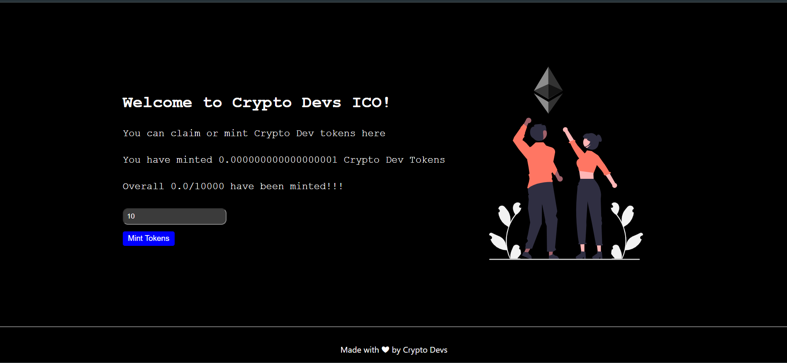

# Initial-Coin-Offering-ICO-for-NFT-marketplace

This is a good Dapp that exhibits as next level dealing with eth blockchain
###  Concepts Involved

    - Solidity    
            OpenZeppelin
            ERC721 Emuerable 
            Ownable
            Custom Smart contracts 
            Receiving Ether
            Mapping
            Payable Function
            Pure Function
            View Functions

    - NextJs
            Api Routing
            CSS Modules
            Use Hooks
            State management
            Conditional Rendering
            Async functions
            Timed Functions
      
    - Ethers.js
            Provider
            Signer
            Utils
            call transactions
      
    - Web3Modal
            Metamask Connection
            Web3Modal Provider

    

It illustrates how you can achieve Initial Coin offering
for the tokens of your blockchain.
         
##### Total Supply
    Total token supply is 1000 CryptoDevTokens
    

### Usage

Here's how the flow Take place

    - A user comes to the site
    - Login Via Metamask
    - Mint the tokens

#### Deployment Network
    Ethereum Goerli
    
    
    
